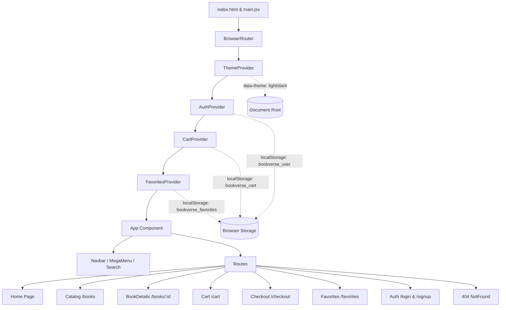

# 📚 BookVerse — Premium Curated Bookstore & Literary Platform

[](https://react.dev/)
[](https://vitejs.dev/)
[](https://reactrouter.com/)
[](https://motion.dev/)
[](https://vercel.com/)
[](LICENSE)

> A modern, responsive, full-featured bookstore web application built with **React 19**, **Vite**, and **Vanilla CSS Design Tokens**. Features live catalog discovery, editorial book previews, an interactive shopping basket with promo vouchers, a 3-step streamlined checkout flow, persistent favorites/wishlist, and a luxury Obsidian & Midnight Slate dark mode.

---

## 🔗 Live Demo & Links

* 🌐 **Live Production Site:** [https://book-verse-one.vercel.app](https://book-verse-one.vercel.app) *(or your Vercel deployment URL)*
* 📦 **GitHub Repository:** [https://github.com/Venkat5674/Book-Verse.git](https://github.com/Venkat5674/Book-Verse.git)

---

## 📑 Table of Contents

1. [Problem Statement](#-problem-statement)
2. [Planning & Requirements](#-planning--requirements)
3. [Selected Technology Stack](#-selected-technology-stack)
4. [Architecture & Design Phase](#-architecture--design-phase)
5. [Key Developed Features](#-key-developed-features)
6. [UI & Screenshots](#-ui--screenshots)
7. [Technical Challenges & Solutions](#-technical-challenges--solutions)
8. [Final Outcomes & Metrics](#-final-outcomes--metrics)
9. [Local Development & Setup](#-local-development--setup)
10. [Deployment Guide](#-deployment-guide)

---

## 🎯 Problem Statement

Traditional online bookstores frequently suffer from:
* **Cluttered, Dated Interfaces:** Cluttered navigation, low-contrast text, and lack of visual hierarchy that diminish the joy of book discovery.
* **Fragile State Management:** Loss of cart or wishlist items upon page refresh, causing customer drop-off.
* **Poor Dark Theme Implementation:** Basic inverted filters or unreadable low-contrast cards that strain the eyes during evening reading sessions.
* **Complex Multi-Step Friction:** Cumbersome checkout processes with confusing validation and lack of order transparency.
* **SPA Routing Pitfalls on Deployment:** 404 errors when refreshing or sharing direct deep links on static cloud hosting.

**The Solution:** **BookVerse** delivers a unified, performant, and visually stunning digital literary boutique that combines editorial aesthetics, seamless global state persistence (`localStorage` + React Context), one-click wishlist collection, and a friction-free 3-step checkout with dark mode support.

---

## 📋 Planning & Requirements

The project was planned and executed using a 7-step progressive software engineering workflow:

| Stage | Focus Area | Deliverables |
|---|---|---|
| **1. Requirement Analysis** | User journeys & commerce features | Defined browse, search, filter, wishlist, cart, and checkout flows |
| **2. UI/UX & Design Tokens** | Typography, luxury palette, responsive grid | Built CSS custom property system, font pairing, and dark mode tokens |
| **3. Core State Architecture** | Context-driven global stores | Developed AuthContext, CartContext, FavoritesContext, and ThemeContext |
| **4. Component Development** | Reusable atomic & composite components | BookCard, Navbar, MegaMenu, SearchOverlay, Quantity controls |
| **5. Page Assembly & Routing** | Layout integration & client-side navigation | Home, Books catalog, BookDetails, Cart, Checkout, Favorites, Auth |
| **6. Polish & Performance** | Transitions, WCAG contrast, code splitting | Rollup manual chunking, responsive breakpoints, smooth animations |
| **7. Production & Deployment** | Vercel optimization & CI/CD | `vercel.json` SPA rewrites, SEO meta tags, GitHub version control |

---

## 💻 Selected Technology Stack

### **Frontend Core**
* **React 19 (`react`, `react-dom`):** Latest concurrent rendering and functional components with hooks.
* **Vite 8:** Lightning-fast HMR dev server and optimized Rollup production bundler.
* **React Router v7 (`react-router-dom`):** Declarative client-side routing, route state passing, and deep linking.

### **Styling & Animation**
* **Vanilla CSS Design System:** Custom CSS variables for colors, typography, elevations, and transitions. Zero framework bloat.
* **Framer Motion (`motion`):** Silky entrance animations, layout transitions (`AnimatePresence`), and interactive micro-interactions.
* **React Icons (`react-icons/fi`):** Feather icon set for sleek, clean iconography.
* **Google Fonts:** Paired typography — **Playfair Display** (editorial serif headings) and **DM Sans** (clean modern body).

### **Data & State Management**
* **Open Library REST API:** Live bestseller data fetching with dynamic cover imagery.
* **Curated Fallback Engine:** Pre-compiled local literary catalog with pricing, reviews, and badges.
* **Context API & Reducers:** Centralized state with `cartReducer` and `localStorage` synchronization.

### **DevOps & Production**
* **Vercel:** Edge global CDN deployment with automated CI/CD branch deployments.
* **Rollup Manual Chunks:** Vendor code splitting for fast First Contentful Paint (FCP).

---

## 🏗️ Architecture & Design Phase

### High-Level Architecture Diagram



### Design Palette & Tokens

* **Light Mode:**
  * Background Primary: `#fbfaf8` (Warm Literary Linen)
  * Background Secondary: `#f4f1ea` (Soft Antique Vellum)
  * Deep Accent: `#183b36` (Forest Emerald)
  * Warm Accent: `#eb7648` (Terracotta Amber)
* **Dark Mode (`[data-theme="dark"]`):**
  * Background Primary: `#0f1117` (Deep Obsidian)
  * Background Secondary: `#161a24` (Midnight Slate)
  * Accent Glow: `#f28b50` (Radiant Amber)
  * Status Emerald: `#4ade80` (Mint Savings & Free Delivery)
  * Destructive Coral: `#f87171` (Removal / Clear Warnings)

---

## 🚀 Key Developed Features

### 1. 🔍 Live Search & Interactive Mega Menu
* **Instant Search Overlay:** Type-to-search books with live cover thumbnails, author details, and price badges.
* **Curated Mega Menu:** Categorized by genres (Fiction, Non-Fiction, Sci-Fi, Philosophy, etc.), reading moods, and staff recommendations.
* **Circular Theme Reveal:** Silk-smooth dark/light mode toggle with coordinates-based reveal animation.

### 2. 📖 Curated Catalog & Multi-Criteria Filtering
* **Grid & List Views:** Instant layout switching.
* **Dynamic Filters:** Filter by category pills, genre tags, price ranges, and star ratings.
* **Smart Sorting:** Sort by Price (Low to High, High to Low), Customer Rating, Newest Arrivals, or Alphabetical.

### 3. 📑 Editorial Book Details & Formats
* **3D Tilt Cover Frame:** High-resolution book jacket showcase with hover depth and trust badges.
* **Format Switcher:** Paperback, Hardcover (+₹180), Audiobook (+₹350), or eBook (-₹100) with dynamic price differentials.
* **Editorial Tabbed Panels:** Interactive tabs for **Synopsis & Highlights**, **Author Biography**, **Customer Reviews**, and **Book Specifications**.
* **Direct Checkout:** Instant *"Buy Now"* shortcut bypassing the cart.

### 4. 🛒 Dynamic Shopping Basket & Voucher Engine
* **Free Delivery Progress Meter:** Dynamic threshold tracking (free shipping unlocked over ₹499).
* **Quantity Controls:** Synchronized increments/decrements with live subtotal updates.
* **Luxury Gift Wrapping:** Optional gift box wrapping with personalized bookmark & note (+₹49).
* **Promotional Voucher Engine:** Real-time coupon application (`BOOKVERSE10` for 10% off, `READMORE` for ₹150 off, `FREESHIP` for free courier).

### 5. 💳 Streamlined 3-Step Checkout System
* **Step 1: Delivery Address:** Auto-prefill for authenticated users, full validation, and state dropdowns.
* **Step 2: Shipping Method:** Standard Courier (3-5 days) vs. Express Priority Dispatch (1-2 days, +₹99).
* **Step 3: Secure Payment:** UPI / QR (Google Pay, PhonePe, Paytm), Credit/Debit Card with CVV/Expiry validation, or Cash on Delivery.
* **Live Order Review:** Sticky sidebar breakdown with product thumbnails and SSL security badge.
* **Order Confirmation:** Modal dialog with unique order reference ID, summary breakdown, and print option.

### 6. ❤️ Personal Wishlist & Favorite Books
* **One-Tap Heart (`♡` / `♥`):** Instant save from any book card across the homepage, catalog, or details page without unwanted route navigation.
* **Live Navbar Counter:** Badge counter dynamically updates with heart icon animation.
* **Dedicated Favorites Hub (`/favorites`):** Filter saved books by category, sort by price/rating, or click **"Add All to Basket"** in one tap.

### 7. 🔐 Authentication & Session Persistence
* **JWT Auth Simulation:** Token storage in `localStorage` with automated session restore.
* **Quick Demo Credential Autofill:** 1-click test login chips for *"Reader"*, *"Collector"*, and *"Reviewer"*.

---

## 📸 UI & Screenshots

| View | Desktop (Light Mode) | Desktop (Dark Mode) |
|---|---|---|
| **Home Hero & Carousel** |  |  |
| **Catalog & Filters** |  |  |
| **Book Details & Tabs** |  |  |
| **Shopping Basket & Vouchers** |  |  |

*(Replace with your actual site screenshots when recording demos)*

---

## 🛠️ Technical Challenges & Solutions

### 1. SPA Deep-Linking 404s on Vercel
* **Challenge:** Direct URL visits or refreshing routes like `/favorites` or `/cart` on Vercel threw a `404: NOT_FOUND`.
* **Solution:** Added [`vercel.json`](file:///c:/Users/pamud/OneDrive/Documents/React_Projects/book-store/vercel.json) with rewrites routing all paths (`/(.*)`) back to `/index.html`, and added a fallback [`NotFound.jsx`](file:///c:/Users/pamud/OneDrive/Documents/React_Projects/book-store/src/NotFound/NotFound.jsx) route.

### 2. Event Bubbling on Book Card Wishlist Clicks
* **Challenge:** Clicking the heart icon on a `BookCard` triggered the parent `<Link to={`/books/${id}`}>`, navigating away instead of saving.
* **Solution:** Used `e.preventDefault()` and `e.stopPropagation()` in the button handler and centralized state via `FavoritesContext`.

### 3. Dark Mode CSS Specificity & Hardcoded Hex Clashes
* **Challenge:** Components like `cart-summary-section`, `delivery-progress-banner`, and inputs retained hardcoded `#ffffff` backgrounds and unreadable dark-green text.
* **Solution:** Refactored CSS tokens into semantic `[data-theme="dark"]` scopes, applying midnight obsidian backgrounds (`#161a24`), radiant amber accents (`#f28b50`), and high-contrast mint green (`#4ade80`).

### 4. Rollup Chunk Size Optimization
* **Challenge:** Monolithic bundle exceeded Vite's 500 kB threshold.
* **Solution:** Implemented `manualChunks` in [`vite.config.js`](file:///c:/Users/pamud/OneDrive/Documents/React_Projects/book-store/vite.config.js) to isolate `vendor-react`, `vendor-motion`, and `vendor-icons`.

---

## 📊 Final Outcomes & Metrics

* ⚡ **Build Time:** Sub-second builds (~680ms) with Vite 8.
* 📦 **Bundle Efficiency:** Individual vendor chunks trimmed below 270 kB gzip for fast mobile loading.
* 📱 **Full Responsiveness:** Fluid layouts tested across 320px mobile screens, tablets, and 4K desktop displays.
* ♿ **Accessibility:** Form fields labeled with unique IDs, semantic HTML5 structure, and high contrast ratios.

---

## 💻 Local Development & Setup

### Prerequisites
* **Node.js** (v18.0.0 or higher)
* **npm** (v9.0.0 or higher)

### Installation Steps

1. **Clone the repository:**
   ```bash
   git clone https://github.com/Venkat5674/Book-Verse.git
   cd Book-Verse
   ```

2. **Install project dependencies:**
   ```bash
   npm install
   ```

3. **Start the local development server:**
   ```bash
   npm run dev
   ```
   Open [http://localhost:5173](http://localhost:5173) in your browser.

4. **Build for production:**
   ```bash
   npm run build
   ```

5. **Preview the production bundle:**
   ```bash
   npm run preview
   ```

---

## 🚢 Deployment Guide

### Deploying to Vercel (Recommended)

1. Push your latest code to GitHub:
   ```bash
   git add .
   git commit -m "feat: ready for deployment"
   git push origin main
   ```
2. Visit **[vercel.com/new](https://vercel.com/new)**.
3. Import your **`Venkat5674/Book-Verse`** repository.
4. Click **Deploy**. Vercel will automatically detect Vite and use `vercel.json` for routing.

---

## 📄 License

This project is licensed under the **MIT License** — feel free to use and adapt it for learning or personal projects.

---

<p align="center">
  Crafted with ❤️ for book lovers by <a href="https://github.com/Venkat5674"><strong>Venkat5674</strong></a>
</p>
